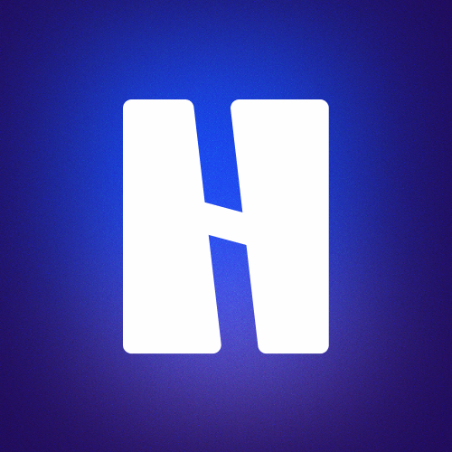
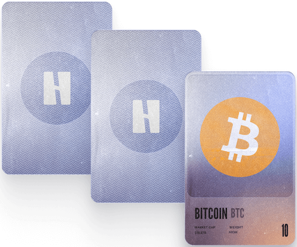
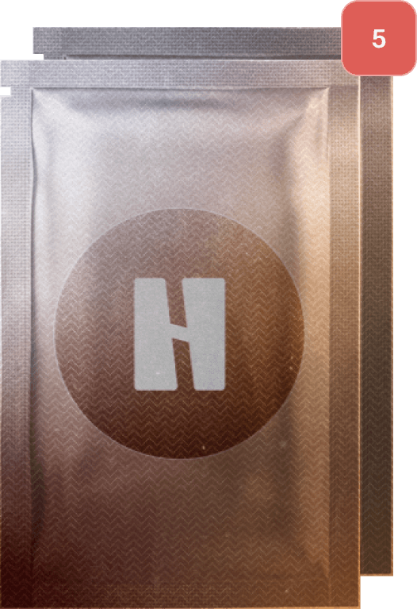
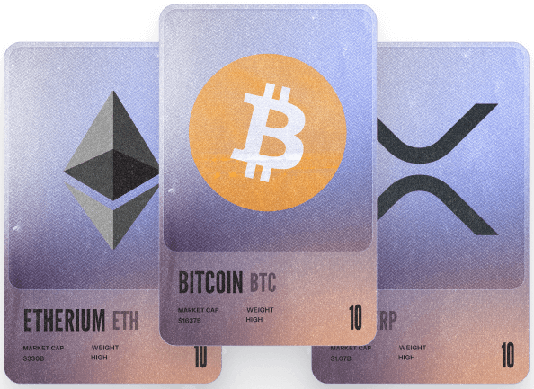
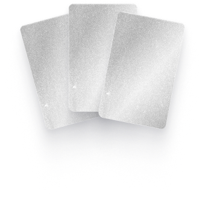

  

<h1 align="center">Hodleague</h1>

  <em>A fantasy league where you collect token cards, build decks, and compete for rewards</em>

 

---

## 🎴 What is it?

**Hodleague** is a game where your intuition and market understanding decide everything. Collect cards, build your deck, and compete in weekly tournaments. Results are driven by real token dynamics — those who read the market best come out on top.

 

  

 

## 📦 Your Weekly Cycle

Every week you receive **5 new card packs**. Open them to collect tokens for the upcoming tournament. Build your deck, register for the tournament, and from Monday to Friday your cards compete based on real market performance. The best performing decks rise on the leaderboard and earn rewards.

  

 

## 🧠 Strategy, Not Luck

Each card has a weight, and your deck has a total weight limit. Your job is to select tokens that will perform best during the tournament week while staying within the limit. It's not just about picking winners — it's about balancing your lineup, analyzing trends, and making thoughtful trade-offs. The strongest combination wins.

  

 

## 🏆 How It Works

| Step | Description |
|------|-------------|
| 📥 Get packs | 5 new card packs every week |
| 🃏 Open & collect | Grow your token collection |
| ⚖️ Build your deck | Pick your lineup within the weight limit |
| 📝 Register | Join the weekly tournament |
| 📈 Watch results | Cards compete on real market data |
| 🎁 Earn rewards | Top decks on the leaderboard win prizes |

 

  

 

## ✨ What Makes Hodleague Different

- **Strategy over luck** — your choices shape the outcome
- **Real data** — results are based on live market dynamics
- **Weekly rhythm** — fresh packs and tournaments every week
- **Competitive** — compare yourself with other players on the leaderboard

---

  <strong>Analyze the market. Pick your lineup. Prove your intuition.</strong>

